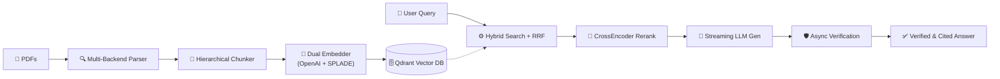

<div align="center">

# 🧠 DocuMind
**A Production-Grade, Hybrid Retrieval-Augmented Generation (RAG) System**

[](https://python.org)
[](https://opensource.org/licenses/MIT)
[](https://github.com/psf/black)

*Precision answer generation across complex financial and academic documents, backed by structured citations and high-fidelity multi-modal extraction.*

</div>

---

## 🚀 Overview

Standard Retrieval-Augmented Generation (RAG) pipelines break down when faced with structurally dense PDFs, multi-page financial tables, and domain-specific acronyms. 

**DocuMind** is purposely built to solve these challenges. It introduces a multi-backend parsing engine, semantic hierarchical chunking, and parallel dense-sparse (Hybrid) retrieval fused with Reciprocal Rank Fusion (RRF). Together with triple-layer background verification, it guarantees responses that are strictly grounded, mathematically verified, and meticulously cited.

## ✨ Key Features

- 📑 **Multi-Modal Parsing:** Dynamically routes document pages to the optimal extraction engine (**PyMuPDF** for digital, **pdfplumber** for tables, **Docling** for OCR).
- 🧩 **Hierarchical Chunking:** Implements parent-child semantic chunking, naturally preserving token limits while preventing context fragmentation. Special handling for table rows and abbreviation-safe sentence splitting.
- ⚡ **Hybrid Retrieval (Dual-Vector):** Parallel search queries over **Qdrant** using both Dense vectors (OpenAI `text-embedding-3-large`) and Sparse learned embeddings (local **SPLADE** model), fused via RRF.
- 🎯 **High-Fidelity Reranking:** Leverages an external CrossEncoder microservice and custom numeric boosting (2x weight on exact number matches) to surface only the most contextually perfect chunks.
- 🛡️ **Triple-Verified Generation:** Asynchronous streaming LLM (`gpt-4o-mini`) is immediately followed by background checks for: (1) Numeric accuracy, (2) Claim grounding & hallucination, (3) Citation formatting. 

---

## 🏗️ Architecture



*For an exhaustive breakdown of the pipeline, refer to the [DocuMind Architecture Documentation](documind_architecture.md).*

---

## 🛠️ Getting Started

### Prerequisites
- Python 3.12+
- OpenAI API Key

### 1. Installation

Clone the repository and set up a virtual environment:

```bash
git clone https://github.com/your-username/DocuMind.git
cd DocuMind

# Create and activate virtual environment
python3.12 -m venv venv
source venv/bin/activate  # On Windows use: venv\Scripts\activate

# Install dependencies
pip install -r requirements.txt
```

### 2. Configuration

Create a `key.env` file in the project root to securely store your variables:

```env
OPENAI_API_KEY="sk-your-openai-api-key"
# Optional: Setup Qdrant DB for cloud mode
# QDRANT_URL="https://your-cluster-url.qdrant.tech"
# QDRANT_API_KEY="your-qdrant-api-key"
```

### 3. Usage

DocuMind runs out-of-the-box in local mode. Start the ingestion and interactive REPL loop by passing a directory of PDFs or a single file:

```bash
python main.py /path/to/your/documents/
```

**Interactive REPL Commands:**
- `Query>` Simply type your query and press enter (e.g. `What was the total revenue for FY2023?`).
- `clear` - Clears the terminal screen.
- `quit` or `exit` - Shuts down the system gracefully.

---

## 📊 Evaluation & Benchmarking

The system is continuously tested against datasets like **FinanceBench** using the industry-standard **RAGAS** framework. 

To run the benchmarking suite:
```bash
python evaluate.py
```
This produces a detailed CSV report judging the pipeline on four critical metrics:
- **Context Precision:** Are the most relevant chunks ranked at the top?
- **Context Recall:** Did the system retrieve all the context truly needed to answer?
- **Faithfulness:** Is the generated answer hallucination-free?
- **Answer Relevancy:** How well does the answer address the user's specific query?

---

## 📁 Repository Structure

```text
DocuMind/
├── main.py              # Application entry point & REPL loop
├── pdf_parser.py        # Intelligent routing to PyMuPDF, pdfplumber, Docling
├── chunker.py           # Configurable parent-child semantic splitting
├── embedder.py          # OpenAI Dense & SPLADE Sparse vectorization 
├── database.py          # Dual-index chunk storage with Qdrant
├── retriever.py         # Search, RRF, Rerank, & metadata filtering logic 
├── generator.py         # LLM abstraction with citation constraints
├── evaluate.py          # RAGAS evaluation harness
├── config.py            # Global hyperparameter management
└── models.py            # Pydantic data schemas 
```

---

## 🤝 Contributing

Contributions are welcome! If you have ideas for architectural improvements or feature requests:
1. Fork the Project
2. Create your Feature Branch (`git checkout -b feature/AmazingFeature`)
3. Commit your Changes (`git commit -m 'Add some AmazingFeature'`)
4. Push to the Branch (`git push origin feature/AmazingFeature`)
5. Open a Pull Request

## 📄 License

Distributed under the MIT License. See `LICENSE` for more information.

---
<div align="center">
  <i>Built for high-stakes document intelligence.</i>
</div>
